# CouncilNote Part B

## CouncilNote Frontend

## Testing Frontend

User account created successfully but undefined, and navigated to login page upon submit, as intended.

## Testing Backend

I mainly used Insomnia, Jest and MongoDB Compass to test the backend, checking if certain routes, functions and features were working.

#### Users:

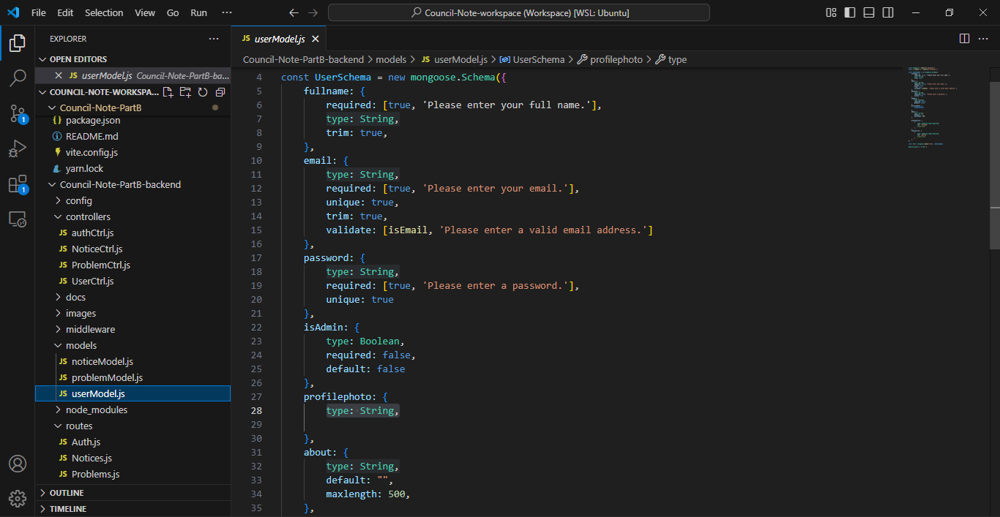

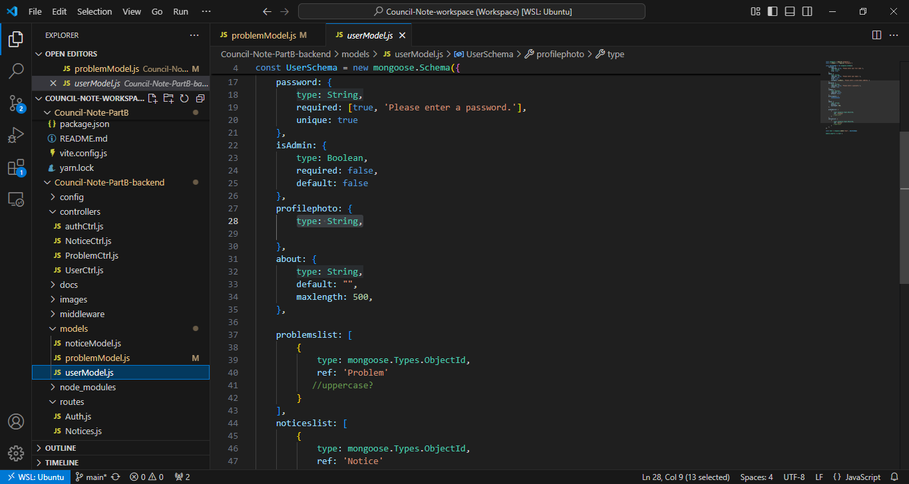

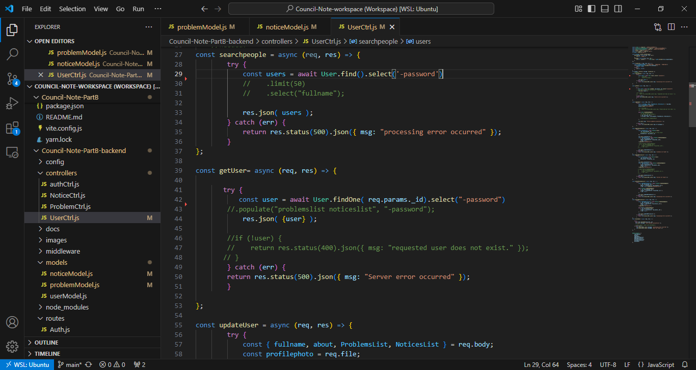

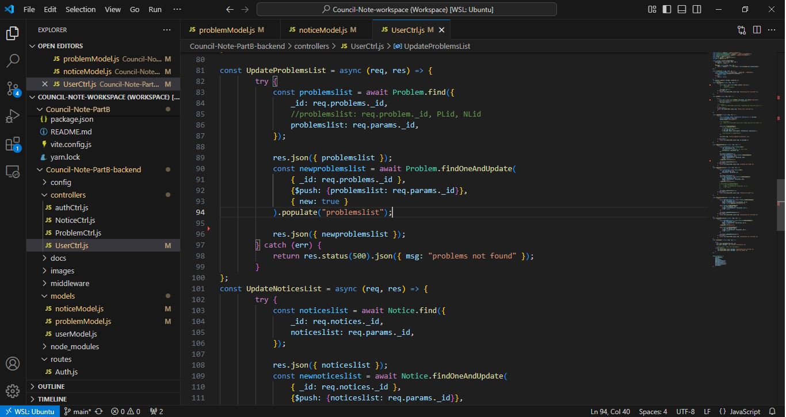

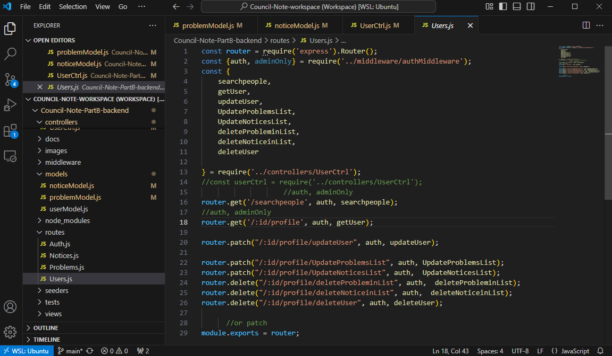

Updating user profile info, such as the "about".

Delete user is working. This might be for if a user closes their account, or if they're banned.

Users data appearing in MongoDB Compass.

#### Auth:

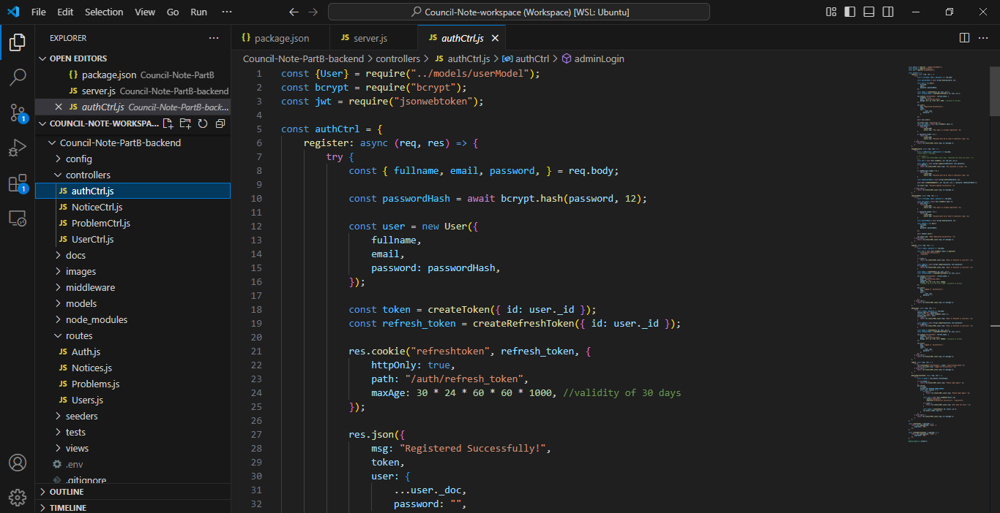

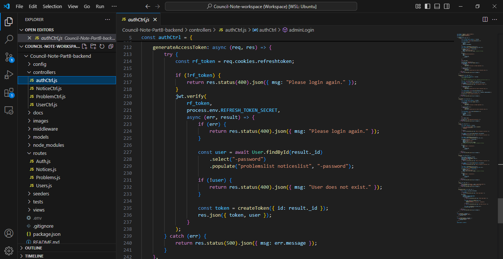

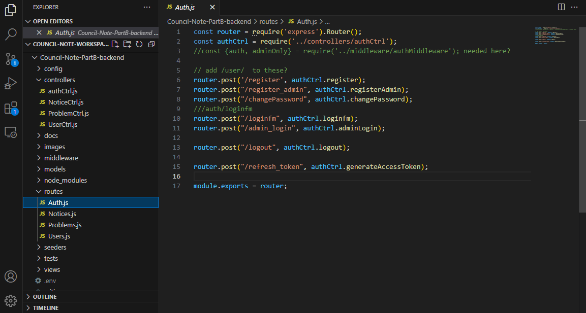

New token generated upon logging in.

#### Problems:

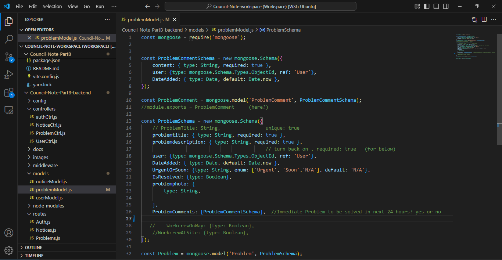

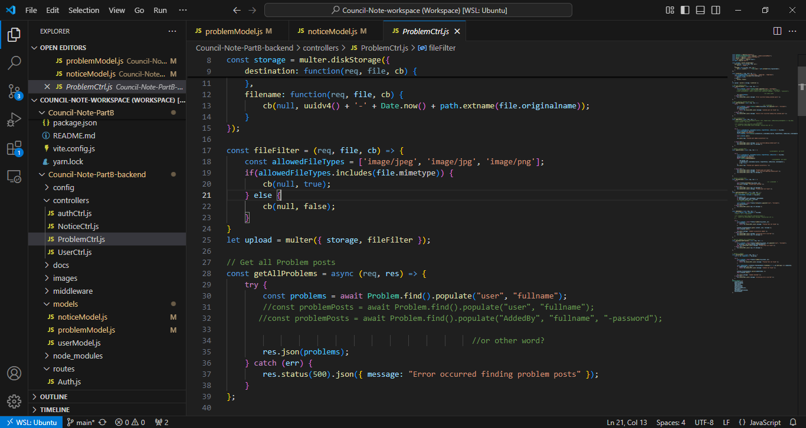

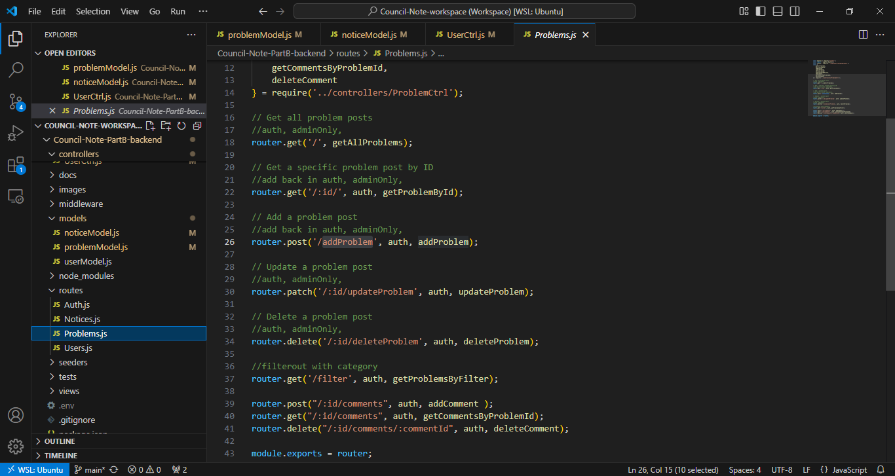

Problem posts including User fullname displayed as intended, and the Problem comments.

Problem posts including User fullname displayed, along with the comments added.

Getting problem comments

Adding problem comments

Getting problems with comments, including the just-added comment.

Problem post updated. I later put Urgent and Soon as UrgentOrSoon and like this in the Problem model: {type: String, enum: ['Urgent', 'Soon','N/A'], default: 'N/A'}, 

Problem post being deleted

Problems data appearing in MongoDB Compass. There is also a "problemcomments" schema but these are populated within the Problem post as intended.

#### Notices:

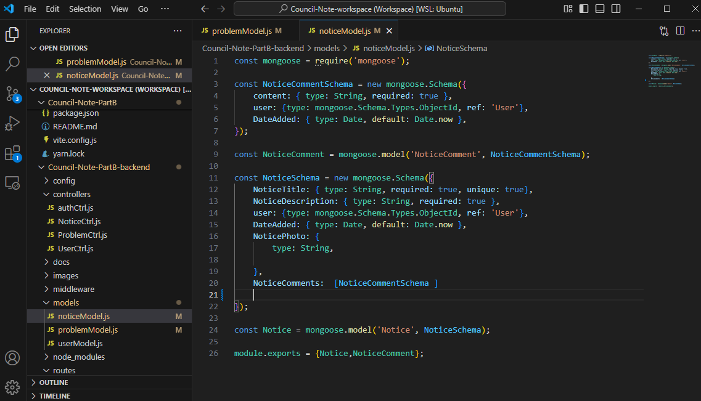

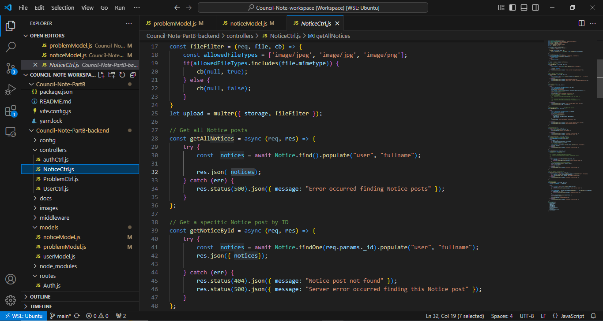

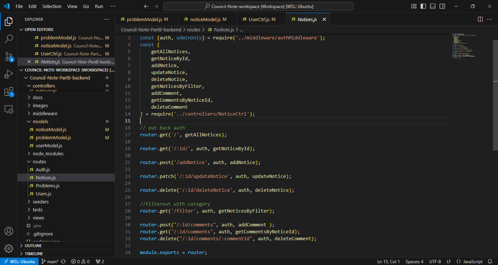

Getting one notice, including user fullname displayed.

Getting notices, including notice comments, and user fullname displayed as intended.

User fullname didn't show on this occasion when adding then getting a notice on Insomnia.

Adding a comment to a notice

Updating a notice

Notice being deleted

Notices data appearing in MongoDB Compass. There is also a "noticecomments" schema but these are populated within the Notice post as intended.

