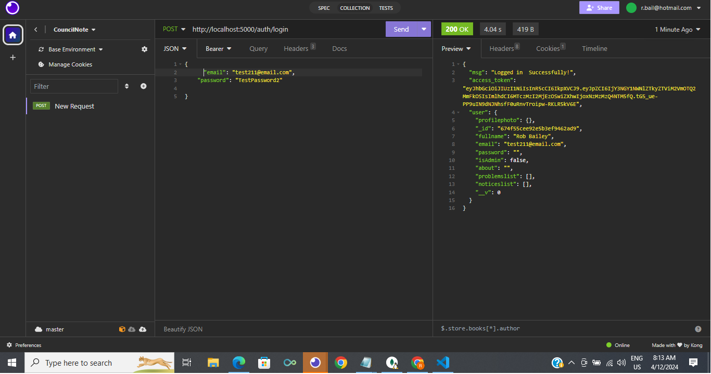

# CouncilNote Part B

## CouncilNote Frontend

## Testing Frontend

User account created successfully but undefined, and navigated to login page upon submit, as intended.

## Testing Backend

I mainly used Insomnia, Jest and MongoDB Compass to test the backend, checking if certain routes, functions and features were working.

#### Users:

#### Auth:

I later on renamed "access_token" as "token" in the AuthCtrl so it might match/work better in the frontend for the "token" in localStorage.setItem("token", response.data.token); for instance. 

#### Problems:

I late put Urgent and Soon as UrgentOrSoon and like this in the Problem model: {type: String, enum: ['Urgent', 'Soon','N/A'], default: 'N/A'}, 

#### Notices:

User fullname didn't show on this occasion when adding then getting a notice on Insomnia.

