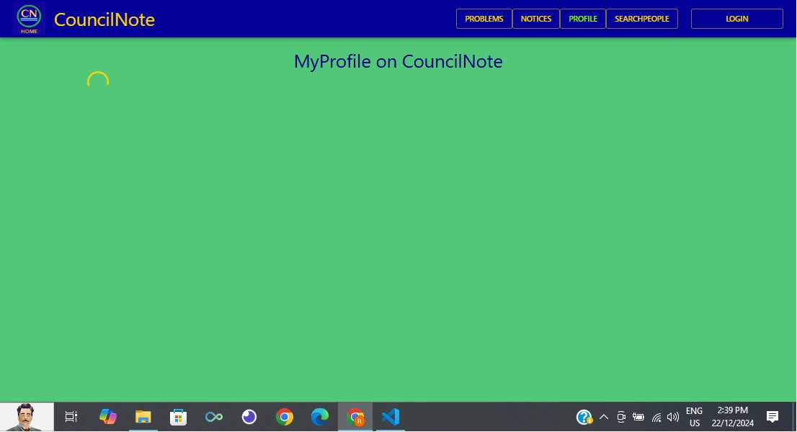
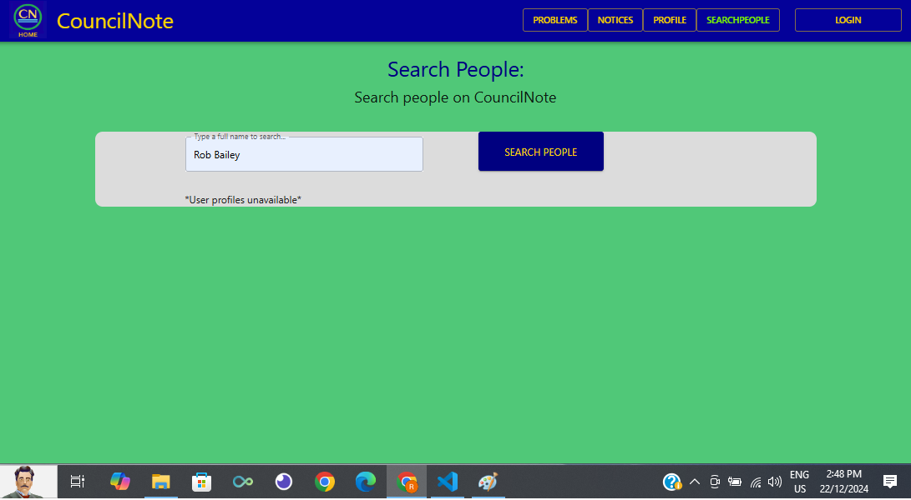
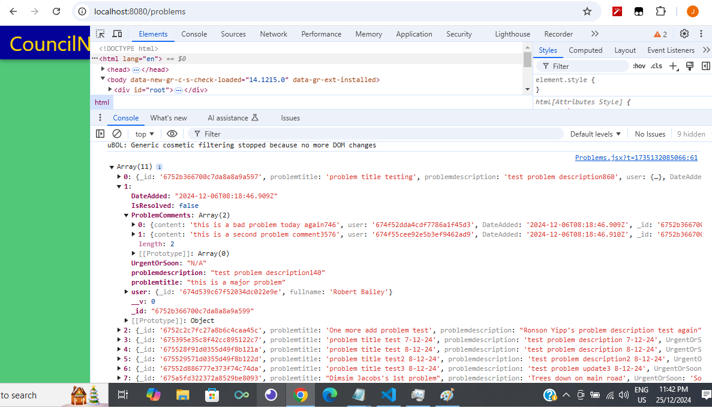
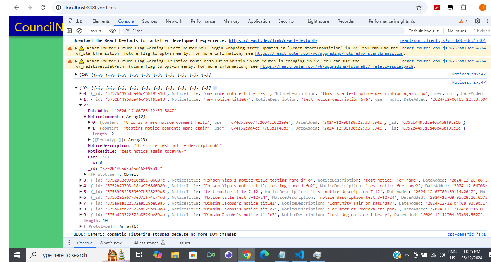

# CouncilNote Part B

To run the frontend locally, VITE_PORT=8080 is used in the .env file.
PORT=5000 is used in the backend .env 

### Deployed Frontend:

https://councilnote.netlify.app/

### Deployed Backend:

https://council-note-backend-5cf218cede7a.herokuapp.com/

### GitHub Repositories:

CouncilNote Part A: https://github.com/Full-Stack-Council-Note/Council-Note-PartA

Frontend: https://github.com/Full-Stack-Council-Note/Council-Note-PartB

Backend: https://github.com/Full-Stack-Council-Note/Council-Note-PartB-backend

## CouncilNote Frontend

Home page:

Home page with drop-down menu:

Login page - mobile:

Problems page - mobile:

Problems page - desktop:

Notices page - mobile:

Notices page:

Profile page:

The Profile page appears mainly blank still but might flash up briefly. 

SearchPeople page:

## Testing Frontend

User account created successfully but undefined, and navigated to login page upon submit, as intended.

Frontend as of 18 Dec 2024, empty problems list.

Frontend as of 18 Dec 2024, empty notices list.

"No Problems Available" on 18 Dec 2024

The Problems page as of 21 Dec 2024. No major issues or errors appear in the console log but still no data appearing in frontend. A couple of more minor issues apparently about form field names and labels, which I attempted to resolve also, but wasn't entirely sure where or how.

And similarly for Notices:

### Beyond 22 Dec 2024:

In the last few days, I have attempted some more to get Problems and Notices data to work and display. This data can display in the console log but still not successfully on the page, and the page can be blank but with no errors in the console log.

Only just now noticed I had for some reason put "export default function Problems()" in Notices.jsx. Would've thought a big error message would show up for that, but didn't make a difference fixing that so far, data still only appears in console log.

31 Dec 2024:

I have now successfully gotten the Problems and Notices data to display on the page, but via edited json files, mainly as a demo a bit closer to what it should look like.

## Testing Backend

I mainly used Insomnia, Jest and MongoDB Compass to test the backend, checking if certain routes, functions and features were working.

The backend was deployed successfully on 18 Dec 2024.

As of 18 Dec 2024, I can get Problems and Notices data from the backend URL (with Auth disabled for this), but was still having trouble displaying and using this data in the frontend.

An earlier server test with Jest:

#### Users:

#### Tests with Jest:

Users and auth tests:

#### Tests with Insomnia and MongoDB Compass:

SearchUsers route. I have since changed this to "/searchpeople" to match with frontend routes and pages a bit more.

Updating user profile info, such as the "about".

Delete user is working. This might be for if a user closes their account, or if they're banned.

Users data appearing in MongoDB Compass.

#### Auth:

#### Tests with Insomnia and MongoDB Compass:

New token generated upon logging in.

Logout successful

#### Problems:

#### Tests with Jest:

#### Tests with Insomnia and MongoDB Compass:

Problem posts including User fullname displayed as intended, and the Problem comments.

Problem posts including User fullname displayed, along with the comments added.

Getting problem comments

Adding a problem

Adding problem comments

Getting problems with comments, including the just-added comment.

Problem post updated. I later put Urgent and Soon as UrgentOrSoon and like this in the Problem model: {type: String, enum: ['Urgent', 'Soon','N/A'], default: 'N/A'}, 

Problem post being deleted

Problems data appearing in MongoDB Compass. There is also a "problemcomments" schema but these are populated within the Problem post as intended. Earlier on, I initiated a schema just called "comments" because I wasn't sure if all comments would be under the same schema/collection, but later changed to "noticecomments" and "problemcomments" to perhaps avoid confusion. 

#### Notices:

#### Tests with Jest:

#### Tests with Insomnia and MongoDB Compass:

Getting one notice, including user fullname displayed.

Getting all notices.

Getting all notices.

Getting notices, including notice comments, and user fullname displayed as intended.

User fullname didn't show on this occasion when adding then getting a notice on Insomnia.

Adding a notice

Adding a comment to a notice

Updating a notice

Notice being deleted

Notices data appearing in MongoDB Compass. There is also a "noticecomments" schema but these are populated within the Notice post as intended.

# Council-Note

## Description

### Purpose

The CouncilNote app will enable users, such as residents, workers and council staff, to report problems in a council area, and keep other users updated. Examples of problems can include "street lights out" on a certain road, "tree down" on a certain footpath, overgrown weeds, rubbish dumped in a wrong location, parking issues, or lost pets. CouncilNote will also feature a Notices section for users to post about activities, events and other fun happenings in the council area.

CouncilNote will be particularly useful for large council areas, in terms of population and land area, such as in London, Sydney, New York, and the Shire of East Pilbara, which has the largest land area in Australia, larger than Victoria and Tasmania combined. With CouncilNote, council staff in Newman, WA, and others across the area, can be informed about problems and hazards happening on roads hundreds of kilometres away, for instance. For those in London, for example, Notices can be posted about the latest exhibitions, street markets and music events, as there is always something happening in London.

### Functionality and features

- It is intended for council staff, such as a council representative, to be authorised as admin, and have some moderation control over users' posts, such as for in case posts are inappropriate or illegal, according to the relevant laws. A council staff rep can delete users' posts if they are deemed inappropriate or illegal. I'll probably add a short statement on the Problems and Notices pages about Users' posts being appropriate and legal, or that they should contact emergency services instead about some Problems.

- Every user of CouncilNote will Register and Login in order to use this app, which can help ensure the legitimacy of users and their posts and comments.

- Every user will have their own User profile, MyProfile, which will include an "about" section which can be filled in and edited by the user, and users can upload a profile photo of themselves. User profiles will include a list or record of recent Problems and Notices posts by users. Hence, with the User profiles, users can know about regular contributors for instance, and some of the topics of their posts. Functionality for users to close their account may be included on MyProfile in future.

- There will be CRUD functionality on all Problems and Notices posts, along with the Comments on these.

- The Problems and Notices pages will feature pagination to allow users to search for previous posts, and each post will display the date it was added.

- The Problems and Notices pages will each feature an input form for users to submit their Problem or Notice. Users will firstly input a title and description of the Problem or Notice.

- On Problems and Notices posts, there will also be the ability for users to upload a photo related to the Problem or Notice.

- Problem posts will also feature coloured symbols, Red and Yellow, to indicate whether the Problem is Urgent or should be dealt with Soon. Users will select either of these, as relevant, before submitting a Problem form. 

- Problem posts will feature a comments section, such as for users to indicate the status of the Problem. Likewise, Notice posts will feature a comments section, such as for users to keep updated on the latest happenings.

There may be a few other additions to the features and functions during development, depending what I find works out, such as perhaps more of a search filter for the Problem and Notice posts, and maybe adding an optional Contact details section for Users' profiles.

Below are some examples of the Urgent and Soon symbols I intend to try out and implement during development of this app, whichever looks and works the best on the Problem posts.

#### Yellow Square symbol

#### Red Square symbol

#### Red Dot symbol

#### Yellow Dot SOON symbol

#### Yellow Square SOON symbol

#### Red Dot URGENT symbol

#### Red Square URGENT symbol

### Target audience

The target audience of CouncilNote is anyone who lives and works in a particular council area, and who is interested in this source of communication and information. The target audience can include council staff themselves, along with residents and other workers in that council area.

### Tech stack

#### Front-end: 

React is used to faciliate the client-side logic of the application, including the  components which handle the sending and retrieval of data to and from the back-end. HTML, MUI, and Javascript are implemented to facilitate responsive designs and features for the users.

Earlier on, I was weighing up either Bootstrap or MUI for the CSS. I like some of the features provided by Bootstrap, but I went with MUI materials for its navbar setup and the theme setup, such as for the green, yellow-orange and dark blue colours of the CouncilNote app. But MUI does seem a bit less flexible sometimes, such as when trying to adjust the colours on the drop-down menu on the navbar, or adjusting margins of items. The Search People page and function is a bit off-centre, for instance.

#### Back-end: 

Express.js, Node.js and Mongoose are used to handle the server-side logic of the application, such as for configuring the app for usage, such as with "app.use()", for starting operation of the server, and connecting to MongoDB.

#### Database: 

MongoDB is used to store data of Users, including their login and profile information, Problems, Notices, and Problem Comments and Notice Comments. Earlier on, I initiated a schema just called "comments" because I wasn't sure if all comments would be under the same schema/collection, but later changed to "noticecomments" and "problemcomments" to perhaps avoid confusion. 

#### Testing: 

Particularly for the backend, I used Jest early on to check successful responses to functions and routes, and the server itself. I then mainly used Insomnia and MongoDB Compass, to further check successful responses to the functions and routes, and to check the data being stored in MongoDB.

I also seeded some data for Users, Problems and Notices, particularly earlier on when 'add' for Problems and Notices still wasn't working yet. As I mentioned in my presentation, and in some other screenshots in this readme, I was intending for the User fullname to appear in each Problem and Notice post, and in the comments for these. This was partly successful from the seeded data, as displayed in Insomnia, but not when "adding" itself on Insomnia. For instance, in the seeded data, I included under the "Problems" and "Notices": 

"user":users.find(obj => obj.fullname === 'Robert Bailey'), 

I wasn't entirely sure how to format this or get the User fullname working/displaying fully successfully, but this was an example I saw and followed, and I think depending on/guided by certain error messages I encountered during this phase.

For the frontend so far, I have mainly used the Console log and user testing to improve the frontend pages and components. For instance, I have tried out the register and login pages and components, using different fullname, email and password details. But the frontend is unlikely to be 100% ready by 22nd Dec 2024. But I might continue working on this app beyond 22nd Dec 2024, and achieve some more of the intended features from the wireframes.

#### Project Management: 

Trello, and a Notepad file where I kept segments and examples of code to try out, certain passwords and login info such as when testing register and login, and some links to articles and tutorials I referred to during development of this app, such as for how to set up user login and register in MERN.

#### Source Control: 

Git and Github

#### Deployment: 

I deployed the frontend to Netlify on 21 Dec 2024. Though, this is not really finished as of 21 Dec, but I might continue working on this app beyond this course, in the next few weeks, eg. try and get the data to work in frontend.

I deployed the backend to Heroku on 18 Dec 2024. This was maybe 70% completed as of 21 Dec 2024, a few routes and functions not fully acheived, but I might work on this some more beyond this course.

## Dataflow Diagram

When drawing up this dataflow diagram, I endeavoured to follow the conventions of dataflow diagrams, mainly Yourdon and Coad, along with my ideas and understanding of the app structure so far.

Earlier on, I thought User and UserProfile would be separate models/schemas, but upon figuring out the backend some more and getting it working without errors on 29 Nov 2024, it looks like User profiles/ the MyProfile page will be populated from a User schema, which includes "about" and "profilephoto".

Earlier version of the dataflow diagram prior to 29 Nov 2024, with separate User and Userprofile schemas:

The updated dataflow diagram as on 19 Dec 2024, to reflect the Problem Comments and Notice Comments schemas instead of Comments, and MyProfile page being changed to Profile: 

I changed MyProfile to Profile to match the routes and paths a bit better, such as by having "/users/:id/profile" because the intention is to enable users to look up (or Get) other users' profiles with this "getUser" route.

## Application Architecture Diagram

## User Stories

The users of CouncilNote will be council staff of whichever council wants to use this app, anywhere in the world, along with residents and other workers in that area.

#### Council Staff
- As a council staff member, such as a Mayor or Councillor, I want to receive information and updates about certain problems from residents and workers in my council area.

- As a council staff member, I'd also like to hear about the events, activities and other fun happenings in my council area, via the Notices posts and comments.

- As a council staff member, I'd like another way to inform residents and other workers of council initiatives, via the Notices posts and comments.

#### Residents

- As a resident, I want to be able to inform and update people on certain events and activities I'm hosting in the council area, via the Notices posts and comments.

- As a resident, I want another way to know about upcoming events and activities nearby, via the Notices posts and comments, and I would like to know about other locals, via their User Profile information.

- As a resident I want to be able to directly inform council staff and others of problems I encounter in the area, such as street lights not working, lost pets or fallen trees.

#### Other Workers

- As a worker, such as a business owner, I want to be able to inform council staff and others in the council area of certain problems, such as with managing parking or rubbish.

- As a worker, such as a restaurateur, I would like another way to inform people in my area of certain events and promotions at my business.

- As work crew member, I can keep council staff and residents up to date about certain problems which are being solved or handled, via the Problems posts and comments.

## Wireframes

I have drawn up the wireframes in this Miro board, to the best of my understanding of React Bootstrap so far, and how the app will piece together accordingly:

https://miro.com/app/board/uXjVLAhsPcw=/

The designs of the Problems, Notices, and MyProfile pages, as displayed in the Wireframes, are partly based on personal experiences of using bulletin boards and blogs pages, such as those which feature an input form which slides up from the bottom of the page, both for adding and editing posts. There is a bulletin board I use which also features a profile page of each user, which includes a list of their recent posts. So some of these features and designs are intended for CouncilNote.

The green, blue and orange-yellow colours for CouncilNote, and the CN logo, are based on colours regularly seen in council logos, with green representing land or vegetation, blue representing rivers or the sea, eg. if it's a seaside council, and orange-yellow representing sand or soil.

By 22 Dec 2024, the Council Note frontend might not be as whiz-bang as intended in these wireframes, but I might continue improving this app beyond 22 Dec 2024.

#### Mobile: Login, Create Account, Problems

#### Mobile: Nav Hamburger, Problem Form, Notices

#### Mobile: View UserProfile, Notice Form, Notices Comments

#### Tablet: Login

#### Tablet: Problems

#### Tablet: Notices

#### Desktop: Login

#### Desktop: MyProfile

#### Desktop: Problems page with comments

#### Desktop: Problems Form

#### Desktop: Problems page

## Screenshots of Trello board

I have used Trello to plan and keep track of the stages of development of this app over the weeks, such as when certain stages should be achieved and completed by.

#### Trello Overall

The CouncilNote Trello board as on 22 Dec 2024:

The CouncilNote Trello board as on 1 Dec 2024:

I started one of the tests successfully on 30 Nov 2024.

https://trello.com/b/IhyWrrV7/council-note

#### Trello Dataflow Diagram

#### Trello Application Architecture Diagram

#### Trello Wireframes

#### Trello Starting Coding

During the week of 17 Nov to 24 Nov 2024, I started some coding, at least trialling, of the frontend and backend to see how this MERN app will piece together and work, and to have some ideas for the Dataflow Diagram, Application Architecture Diagram and Wireframes.

#### Continuing and completing coding/filling out of files

#### Testing of Application

I was delayed some hours by a blackout on 5 Dec 2024.

#### Trello Successful Deployment

